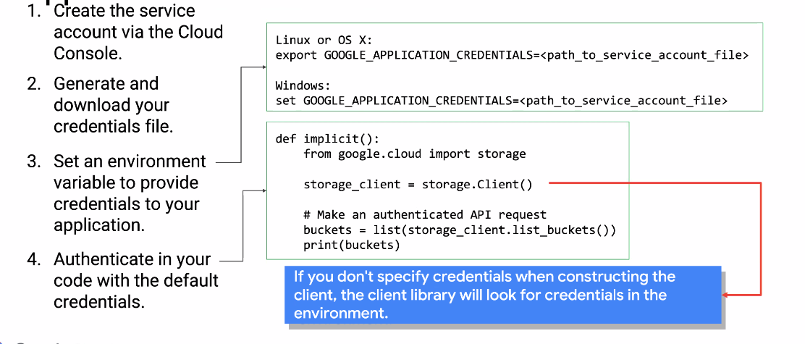

# Authorization and Authentication

## Cloud IAM

Identity and access management.

Types of IAM members:

- Google Account
- Service Account
- Google Group
- Google Workspace Domain
- Cloud Identity Domain

### Permission syntax

`<service>.<resource>.<permission>`

### Service Accounts

Use service accounts to auth your apps with google APIs.
You can create keys for accounts within google or create them externally.

### Best Practices for IAM

