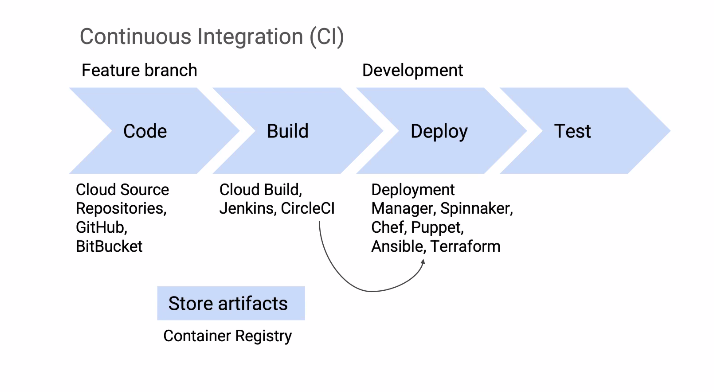
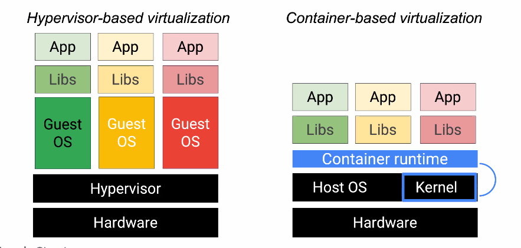

# CI/CD in GCP

Implement continuous integration and delivery for reliable releases.

- Support rollbacks
- Use containers

## Containers

Containers offer an efficient way to isolate code and manage workloads.

### Anatomy of a container

### Why use containers?

- Consistency
- Loose Coupling
- Workload Migration
- Agility

