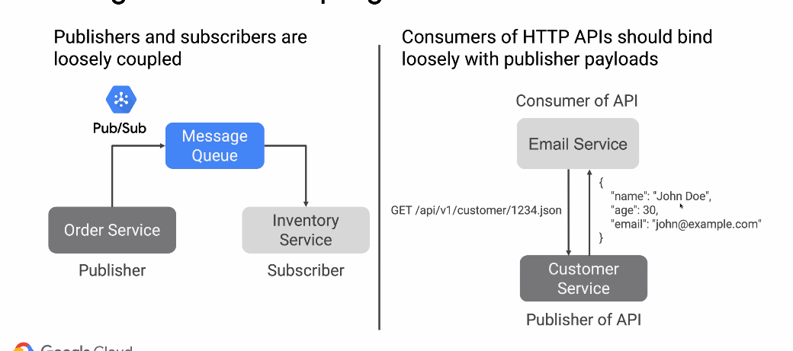
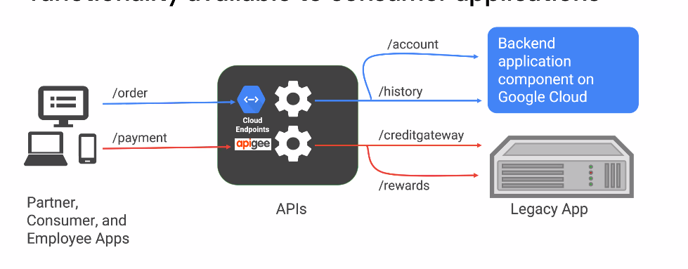
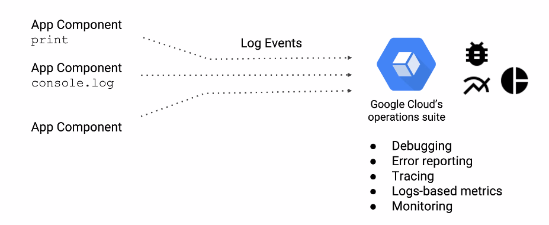
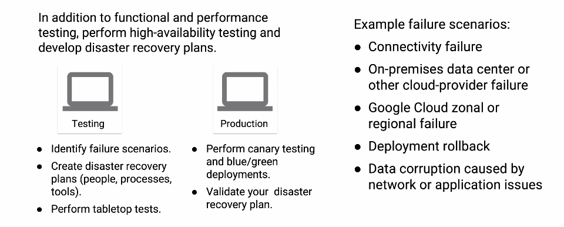
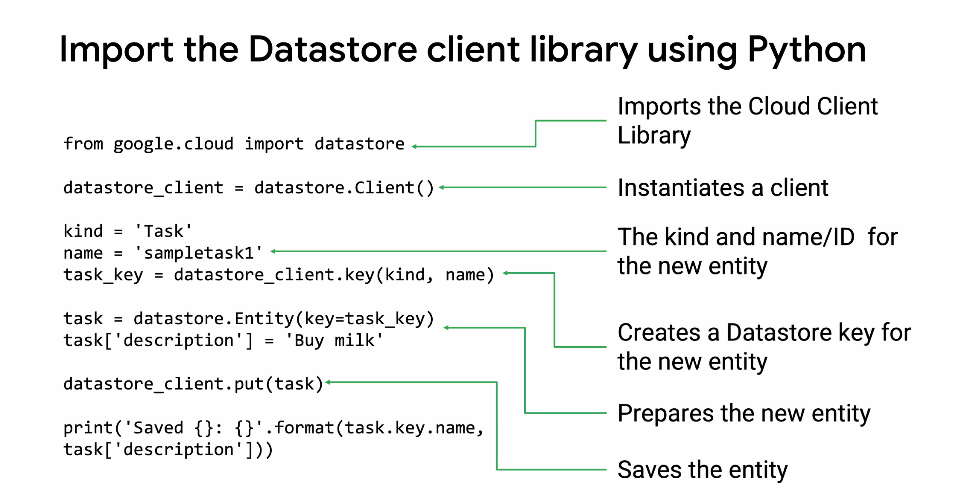

# GCP Built for the Cloud

- Global Reach
- Scalability/High Availability
- Security

Apps designed to run on the cloud need to handle these three pillars.

## Security

Focus on security in different locations. Things are no longer isolated due to the cloud.

## Management

- Code Repository
- Dependency Management
- Configure Settings
- Environment Variables

# Know the differences

## Monolithic

- Codebase becomes large
- Packages have tangled dependencies

## Microservices

- Service boundaries match business boundaries
- Codebase is modular
- Each service independently deployable
- Redundancy is easier across global zones (server resiliency)

### Today

It's tough to get scale out of monolithic apps now.
It's more expensive because of massive VMs/redundancy.

# Async Operations

Use event-driven processing to keep UI responsive
and preform backend operations async.

## Design for loose coupling

Use pub/sub to create async with a Message Queue.
If using an API you should bind loosely with publisher payloads.

## Stateless components for scalability

Workers perform compute tasks without sharing states.
Use some other system to store state. Workers can scale.
IoT data streams into pub/sub topic.
Caching is big here, cache your data to improve performance.
Memcache, redis, or cdn can all handle caching.

# Api Gateways

Implement Api gateways to make backend functionality available.

# Auth

Use federated authorization services for performance/security.

# Health Checks

Implement health-check endpoints for monitoring.
Allows you to make sure your cloud apps are up. You will catch
issues before your customers find it. Your health checks should
trace across all microservices and dependency components.

# Logging

Setup logging to also monitor your performance. Treat your logs as
event stream. Don't manage log files, instead have application stream
to standard out and use some setup to aggregate or log driver.

You can use RSyslog to do it yourself.

# Errors

Handle transient and long-lasting errors gracefully.
Implementing a circuit breaker is a good idea. It's better to
degrade an application gracefully, rather than show an error to the customer.

# Tests

- Perform high availability testing
- Tests go in a CI/CD pipeline
- Perform canary testing and blue/green deployments
- Find/research failure scenarios
- Created targeted tests for failure scenarios

# CI/CD Pipelines

Implement continuous integration and continuous delivery pipelines.

# Cloud Client Libraries

- latest way to make requests to server
- provide idiomatic code in each language
- receive performance benefits from gRPC APIs

## Getting started

There are github repos from google giving examples for CCL with instructions.

## Cloud Shell

Allows you to use a vm to access your apps from the web. It has 5gb of persistent
storage!